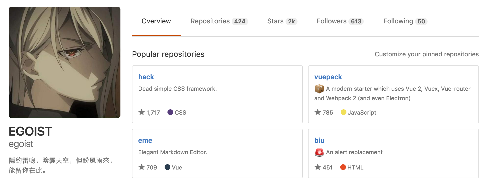
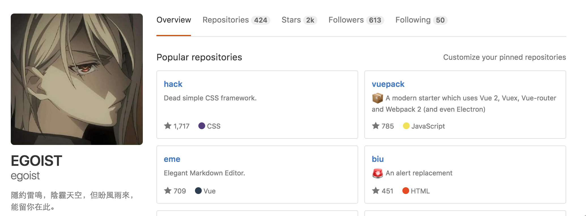
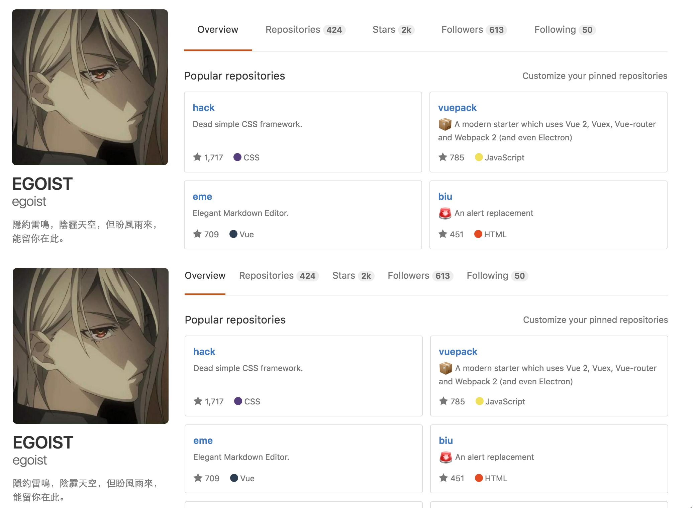

# image-merge

[](https://npmjs.com/package/image-merge) [](https://npmjs.com/package/image-merge) [](https://circleci.com/gh/egoist/image-merge)

> Merge multiple images into one!

## Prerequisites

You should have [GraphicsMagick](http://www.graphicsmagick.org/) installed first:

```bash
# use homebrew if you're on a Mac
$ brew install graphicsmagick
# otherwise head to official installation guide
# http://www.graphicsmagick.org/README.html#installation
```

## Install

```bash
$ npm install -g image-merge
```

## Usage

```bash
$ image-merge a.png b.png -o output.jpg
```

## Preview

__a.png__:



__b.png__:



__output.jpg__:



## Contributing

1. Fork it!
2. Create your feature branch: `git checkout -b my-new-feature`
3. Commit your changes: `git commit -am 'Add some feature'`
4. Push to the branch: `git push origin my-new-feature`
5. Submit a pull request :D

## License

[MIT](https://egoist.mit-license.org/) © [EGOIST](https://github.com/egoist)
